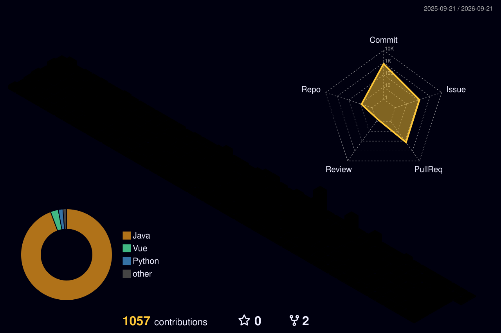

# Seyoung An

 
 

## 🚀 Projects

### 🛒 AgentCart

**2026.05 ~ Present**

**LLM 기반 AI 구매 의사결정 백엔드 시스템**

Planner → Executor → Evaluator 구조의 AI Agent를 활용하여
사용자의 조건에 맞는 상품을 탐색하고 추천하는 서비스입니다.

 

`Java` `Spring Boot` `LLM` `RAG` `SSE` `MySQL`

 
 

---

### 🏦 [노후도락]([YOUR_GITHUB_URL](https://github.com/jejugom))

**2025.XX ~ 2025.XX**

**시니어를 위한 맞춤형 금융 플랫폼**

자산 분석, 맞춤형 금융상품 추천, 상속·증여 시뮬레이션과
은행 방문 예약 기능을 제공하는 시니어 금융 서비스입니다.

 

`Java` `Spring Boot` `Vue.js` `MySQL`

 
 

---

### 🌼 Flower Detection

**2024.XX ~ 2024.XX**

**YOLOv8 기반 꽃 객체 인식 웹 서비스**

YOLOv8 모델을 TensorFlow.js로 변환하여
브라우저 환경에서 실시간 꽃 객체 인식을 구현한 프로젝트입니다.

 

`React` `TensorFlow.js` `YOLOv8` `Node.js` `MongoDB`

 
 

---

## 💻 Languages

 
 

---

## 🛠 Skills

 

 
 

---

## 🔧 Tools

 
 

---

## ☁️ Hosting

 
 

---

## 📦 Others

 
 

---

